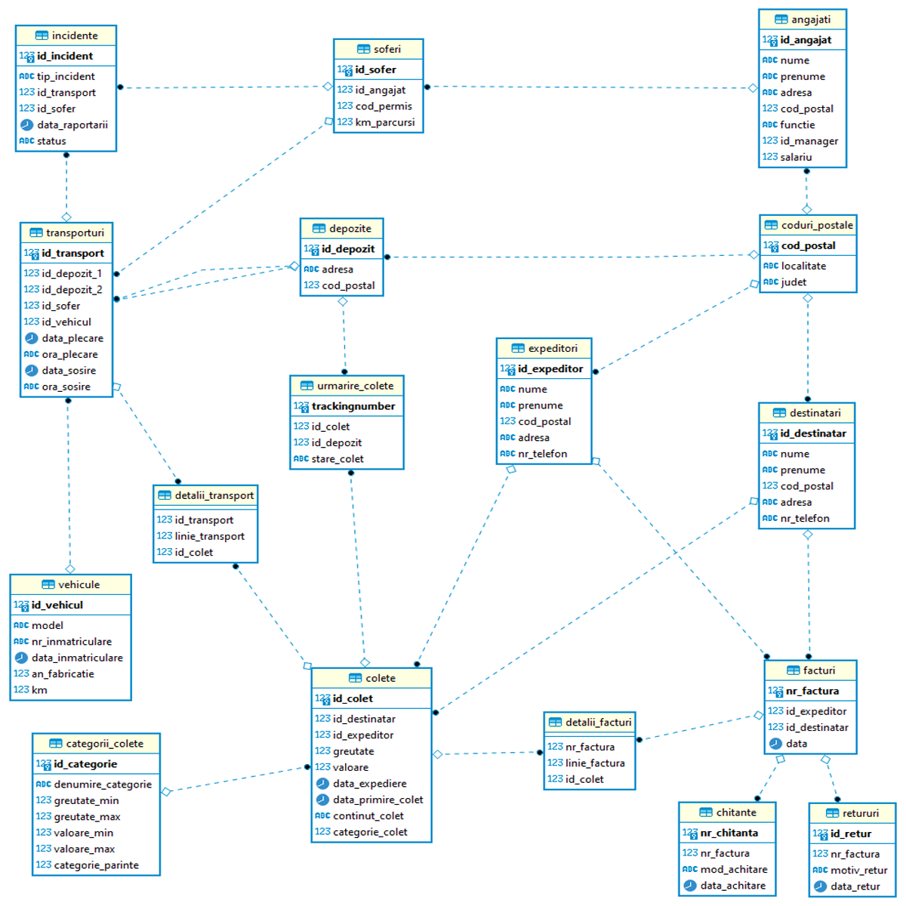

# recursive-sql
- Sets of recursive queries in PostgreSQL &amp; Oracle for a fictive courier company. 
- These queries were created for analyze the execution time under conditions of large data sets. 
- The structure of database can be consulted in the following image: 

